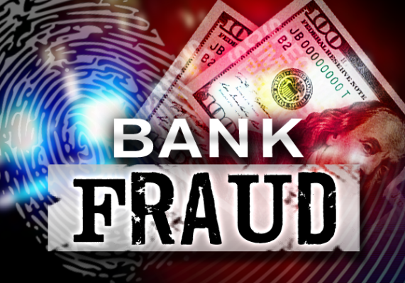

## Bank_Fraud_Detection

**This is a project to predict whether these customers are credible or not for a bank.**  
**1. The test set contains customer’s basic attributes and payment histories.  
2.The output will predict whether these customers are credible or not.**  

## Data Description:  
label.test.csv - the test set, contains customer’s basic attributes and payment histories.  
sample submission.csv - a file showing the correct submission format. 

id: A unique Id field which represents a customer  
X1: Credit line
X2: Gender (1 = male; 2 = female).  
X3: Education (1 = graduate school; 2 = university; 3 = high school; 4 = others). 
X4: Marital status (1 = married; 2 = single; 3 = others).  
X5: Age (year).  
X6 - X11: History of past payment. 
X6 = September, 2015;  
X7 = August, 2015;  
X11 =April, 2015. -1 = pay one month ahead; -2 = pay two month ahead; 0 = pay on time; Positive means the payment delayed months, 1 = delay 1 month, 2 = delay 2 months, etc.
X12- X17: Amount in bill statement.  
X12 = amount of bill statementSeptember, 2015  
X13 = amount of bill statementAugust, 2015  
X17 = amount of bill statementApril, 2015.   
X18-X23: Amount of previous payment  
X18 = amount paid in September, 2015;
X19 = amount paid in August, 2015; 
X23 = amount paid in April, 2015.  
Y: A binary response variable to indicate whether the customer is creditable (1) or not (0).  
